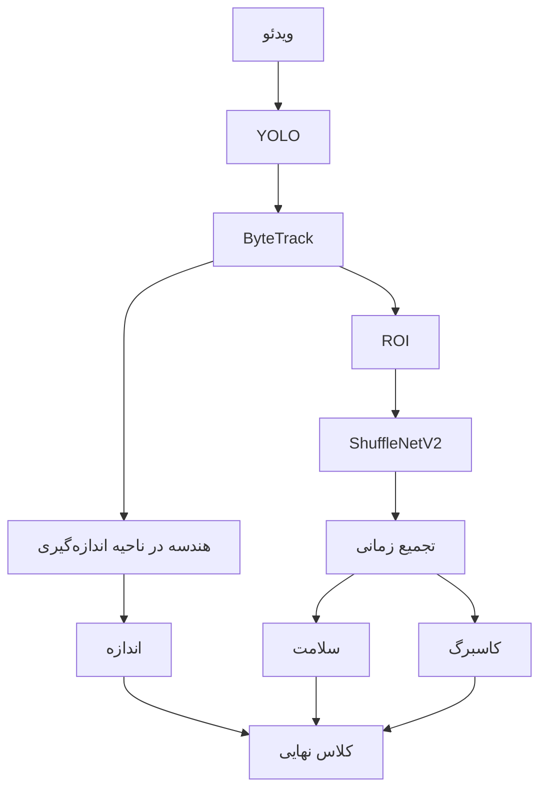

# سامانه بینایی ماشین مرتب‌سازی گوجه گیلاسی

[English](README.md) | **فارسی**

این پروژه یک pipeline آفلاین بینایی ماشین برای تحلیل و مرتب‌سازی گوجه‌های گیلاسی در ویدئوی نوار نقاله است.

- **ورودی:** یک ویدئو، یک پوشه از ویدئوها یا یک الگوی glob
- **خروجی:** ویدئوی حاشیه‌نویسی‌شده، JSON هر گوجه، CSV اندازه‌ها و JSON بنچمارک اجرا
- **جریان پردازش:** تشخیص YOLO → ردیابی ByteTrack → استخراج ROI → استنتاج ShuffleNetV2 → تجمیع زمانی → کلاس نهایی

سامانه در نهایت **۱۲ حالت مرتب‌سازی** می‌سازد، اما شبکهٔ عصبی مستقیماً یک مسئلهٔ ۱۲کلاسه را حل نمی‌کند. کلاس نهایی ترکیب `۳ اندازه × ۲ وضعیت سلامت × ۲ وضعیت کاسبرگ` است. اندازه از هندسهٔ bounding box به دست می‌آید و سلامت و وجود کاسبرگ دو خروجی مستقل classifier هستند.

## معماری



Detector روی همهٔ فریم‌ها اجرا می‌شود. ByteTrack هویت هر گوجه را بین فریم‌ها نگه می‌دارد. crop مربوط به trackهای معتبر به مدل دوخروجی ShuffleNetV2 داده می‌شود و چند مشاهدهٔ زمانی پیش از قفل‌شدن تصمیم سلامت تجمیع می‌شوند. احتمال کاسبرگ نیز روی مشاهده‌ها میانگین‌گیری می‌شود. اندازه مستقل از classifier و داخل یک measurement zone ثابت محاسبه می‌شود.

## دمو


- [ویدئوی کامل خروجی](assets/demo/annotated_sample.mp4)

این دمو خروجی حاشیه‌نویسی‌شدهٔ pipeline بازبینی‌شده با آستانه‌های اندازهٔ `150/250 px` است. برای مناسب‌تر شدن نمایش در portfolio، ۱۵ ثانیهٔ نخست منبع با سرعت `1.3×` پخش می‌شود و دو ثانیهٔ پایانی منبع حذف شده است؛ خود annotationها دست‌کاری نشده‌اند. GIF بخشی کوتاه از همین خروجی است.

گوجه‌هایی که کاسبرگ دارند با علامت ستاره بالای bounding box مشخص می‌شوند. رنگ ستاره از رنگ تصمیم سلامت در visualization پیروی می‌کند.

## منطق پردازش

1. YOLO در هر فریم محل گوجه‌ها را تشخیص می‌دهد.
2. ByteTrack تشخیص‌های متوالی را به یک شناسهٔ ثابت متصل می‌کند.
3. فقط trackهای معتبر در ناحیهٔ classification برای classifier crop می‌شوند.
4. classifier به‌طور پیش‌فرض هر سه فریم یک‌بار برای هر track فعال اجرا می‌شود؛ پس از قفل‌شدن تصمیم سلامت، محاسبات غیرضروری متوقف می‌شود.
5. خروجی‌های چند فریم با policy زمانی تجمیع می‌شوند تا تصمیم به یک فریم وابسته نباشد.
6. کوتاه‌ترین ضلع bounding box در measurement zone به‌عنوان نمایندهٔ اندازه ثبت می‌شود.
7. اندازه، سلامت و کاسبرگ به کلاس نهایی ترکیبی تبدیل می‌شوند.

## نتایج

نتایج classifier از metadata مجموعهٔ آزمون نگه‌داشته‌شده با `n = 208` آمده‌اند:

| وظیفه | Accuracy | Precision | Recall | F1 | ROC AUC |
|---|---:|---:|---:|---:|---:|
| سلامت | 92.31% | 83.33% | 83.33% | 83.33% | 95.48% |
| کاسبرگ | 97.12% | 99.35% | 96.86% | 98.09% | 98.67% |

دقت مشترک سلامت و کاسبرگ **89.90%** است. این اعداد عملکرد classifier روی test set را نشان می‌دهند و معیار دقت end-to-end نوار نقاله نیستند.

### نمونه اجرای end-to-end

اجرای دو ویدئو در Colab روی CPU با موفقیت تمام شده است. اعداد زیر شمارش خروجی اجرا هستند، نه accuracy:

| ویدئو | Track | طبقه‌بندی‌شده | سلامت: H/U | کاسبرگ: P/A | اندازه: S/M/L | FPS پردازش |
|---|---:|---:|---:|---:|---:|---:|
| `video_01.mp4` | 60 | 56 | 39 / 17 | 29 / 27 | 7 / 21 / 13 | 6.81 |
| `video_02.mp4` | 60 | 56 | 42 / 14 | 31 / 25 | 19 / 34 / 1 | 6.47 |

در هر ویدئو چهار track بدون تصمیم نهایی classifier تمام شده‌اند. تعداد اندازه‌های نهایی نیز ممکن است کمتر باشد، چون اندازه فقط هنگام ورود یک box معتبر به measurement zone ثبت می‌شود.

## نصب

Python نسخهٔ 3.10 تا 3.13 پشتیبانی می‌شود. فایل requirements بر اساس نسخهٔ Python، جفت سازگار PyTorch و torchvision را انتخاب می‌کند. وجود wheelهای نسخه‌های pin‌شده برای Linux x86-64، Windows x86-64 و macOS Apple Silicon بررسی شده و کل pipeline روی Colab/Linux CPU اجرا شده است.

### Linux و macOS

```bash
git clone https://github.com/aminashojaei/cherry-tomato-vision-sorting.git
cd cherry-tomato-vision-sorting
python -m venv .venv
source .venv/bin/activate
python -m pip install --upgrade pip
pip install -r requirements.txt
```

### Windows PowerShell

```powershell
git clone https://github.com/aminashojaei/cherry-tomato-vision-sorting.git
Set-Location cherry-tomato-vision-sorting
py -m venv .venv
.\.venv\Scripts\Activate.ps1
python -m pip install --upgrade pip
python -m pip install -r requirements.txt
```

برای CUDA ابتدا build متناسب PyTorch با CUDA سیستم را نصب کنید و سپس باقی dependencyهای pin‌شده را نصب کنید.

## Docker

workflow Docker از image پایهٔ Python 3.11.11 و dependencyهای pin‌شدهٔ CPU استفاده می‌کند و هدف آن `linux/amd64` است. هنگام ساخت هر image نهایی، hash هر دو مدل بررسی و کل test suite اجرا می‌شود. runtime stage به marker ساخته‌شده در test stage وابسته است؛ بنابراین fail شدن هر تست مانع ساخته‌شدن image نهایی می‌شود.

```bash
mkdir -p inputs outputs
docker compose build
docker compose run --rm tomato-sorting
```

ویدئوها را داخل `inputs/` بگذارید. ویدئوهای annotated و گزارش‌ها در `outputs/` نوشته می‌شوند. دستورات Windows PowerShell، smoke test تک‌ویدئو و بخش عیب‌یابی در [راهنمای کامل Docker](docs/DOCKER.fa.md) آمده‌اند.

## استفاده

پردازش یک ویدئو:

```bash
python run_pipeline.py --config config/config.yaml --input inputs/sample.mp4 --output-dir outputs
```

پردازش همهٔ ویدئوهای یک پوشه:

```bash
python run_pipeline.py --config config/config.yaml --input inputs --output-dir outputs
```

اجرای کوتاه برای بررسی نصب:

```bash
python run_pipeline.py --config config/config.yaml --input inputs/sample.mp4 --output-dir outputs/smoke-test --device cpu --max-frames 120
```

برای هر ویدئو یک پوشه شامل `annotated.mp4`، `tomatoes.json`، `size_measurements.csv` و `benchmark.json` ساخته می‌شود. در سطح batch نیز `batch_summary.json` نوشته می‌شود.

Notebook پوشهٔ `notebooks/` همان requirements و CLI پروژه را استفاده می‌کند، hash وزن‌ها را کنترل می‌کند، خروجی‌ها را خلاصه و ویدئوی annotated را preview می‌کند و در پایان archive خروجی را برای دانلود می‌سازد.

## مدل‌ها

| مؤلفه | فایل | کاربرد |
|---|---|---|
| YOLO | `models/detector/yolo_tomato_detector.pt` | تشخیص گوجه |
| ShuffleNetV2 دوخروجی | `models/classifier/shufflenet_multitask.pt` | logits سلامت و کاسبرگ |
| metadata آستانه | `models/classifier/shufflenet_multitask_thresholds.json` | آستانه‌های تصمیم انتخاب‌شده روی validation |
| metadata آزمون | `models/classifier/shufflenet_multitask_metrics.json` | نتایج classifier روی test set |

SHA-256 وزن‌های release:

```text
d7de5dfd8a97509fb0e749c0030942323f1a3b9c390279d156b389af04d0e82d  yolo_tomato_detector.pt
d209caa10840b07aee07940d2de6747c7906c3cba7b8a12c825eae3bcdfb8c09  shufflenet_multitask.pt
```

در خروجی سلامت، کلاس `unhealthy` با آستانهٔ `0.375` مثبت در نظر گرفته می‌شود. در خروجی کاسبرگ نیز `present` با آستانهٔ `0.77` کلاس مثبت است.

## Dataset

تصاویر آموزش داخل repository قرار ندارند. metadata موجود یک test split شامل ۲۰۸ تصویر را ثبت می‌کند. پیش از آنکه نتایج کاملاً قابل بازتولید مستقل تلقی شوند، باید منشأ dataset، روش جمع‌آوری، توازن کلاس‌ها و مجوز انتشار آن مستند شوند.

ویدئوی ورودی باید به نمای deployment نزدیک باشد: دوربین ثابت، مسیر نوار نقاله پایدار و عبور گوجه‌ها از zoneهای تنظیم‌شدهٔ tracking، classification و measurement.

## تخمین اندازه

اندازه در نسخهٔ فعلی یک **نماینده در فضای پیکسل** است، نه قطر فیزیکی واقعی. در نخستین مشاهدهٔ معتبر داخل measurement zone، کوتاه‌ترین ضلع bounding box استفاده می‌شود:

- `Small`: ضلع کوتاه‌تر ≤ 150 px
- `Medium`: 150 px < ضلع کوتاه‌تر ≤ 250 px
- `Large`: ضلع کوتاه‌تر > 250 px

measurement zone تخمین را به بخش باریکی از تصویر محدود می‌کند که اثر perspective در آن یکنواخت‌تر است. بدون کالیبراسیون دوربین و هندسهٔ مشخص، یک گوجهٔ یکسان در نقاط مختلف تصویر می‌تواند تعداد پیکسل متفاوتی داشته باشد. این آستانه‌ها فقط برای setup مشابه دوربینی که روی آن تنظیم شده‌اند معتبرند.

برای کالیبراسیون دوباره، `size_estimation.thresholds` و zoneهای مربوط را در `config/config.yaml` تغییر دهید؛ مستطیل‌های روی ویدئو از همان zoneهای پردازش استفاده می‌کنند. اندازه‌گیر فعلی فقط `metric: min_dimension` و `required_samples: 1` را پیاده‌سازی کرده است؛ افزایش تعداد نمونه به تغییر منطق اندازه‌گیری نیاز دارد.

## محدودیت‌ها

- اندازه‌ها پیکسلی‌اند و نباید به میلی‌متر تعبیر شوند.
- تغییر resolution، crop، لنز، ارتفاع دوربین یا هندسهٔ نوار به کالیبراسیون دوبارهٔ zoneها و thresholdها نیاز دارد.
- معیارهای classifier شامل missهای detector، تعویض شناسه در tracker یا دقت کل pipeline نیستند.
- تجمیع زمانی نویز فریم‌به‌فریم را کم می‌کند اما ممکن است تصمیم نهایی را عقب بیندازد.
- نمونه‌گیری کاسبرگ با قفل شدن تصمیم سلامت متوقف می‌شود؛ بنابراین میانگین آن ممکن است از نمونه‌های کمتری نسبت به یک policy مستقل ساخته شود.
- `passed` یعنی track طبقه‌بندی‌شده به مدت buffer ردیابی ناپدید شده است، نه عبور اثبات‌شده از خط خروج فیزیکی. track فعال در پایان ویدئو `passed` شمرده نمی‌شود.
- فایل‌های checkpoint باینری PyTorch هستند؛ فقط وزن‌های منبع قابل اعتماد را بارگذاری کنید.
- pipeline فعلی برای پردازش آفلاین ویدئو است و کنترل‌کنندهٔ real-time عملگر مکانیکی نیست.
- پشتیبانی codec و سرعت اجرا به build سیستم‌عامل، OpenCV، FFmpeg و سخت‌افزار بستگی دارد.
- image فعلی Docker فقط CPU است و Linux x86-64 را هدف می‌گیرد. Apple Silicon آن را با emulation معماری x86-64 اجرا می‌کند.

## ساختار پروژه

```text
cherry-tomato-vision-sorting/
├── classifier/       # مدل، preprocessing و temporal policy
├── config/           # تنظیمات اجرا و آستانه‌ها
├── core/             # schemaها، interfaceها و validation
├── crop/             # استخراج ROI و quality gate
├── detector/         # اتصال YOLO
├── docs/             # نمودار معماری و راهنمای انتشار
├── geometry/         # تخمین اندازهٔ پیکسلی
├── models/           # وزن‌ها و metadata مدل‌ها
├── notebooks/        # workflow سازگار Colab
├── pipeline/         # orchestration تک‌ویدئو و batch
├── tests/            # آزمون‌های unit و سازگاری
├── tracker/          # ByteTrack و وضعیت trackها
├── utils/            # video I/O، گزارش، device و timing
├── visualization/    # boxها، zoneها و sidebar
├── Dockerfile        # image چندمرحله‌ای CPU همراه تست
├── compose.yaml      # اتصال پوشه‌های ورودی و خروجی
├── requirements-docker-cpu.txt
├── requirements.txt
└── run_pipeline.py
```

اجرای testها:

```bash
python -m unittest discover -s tests -v
```

برای مراحل به‌روزرسانی و ارسال تغییرها به مخزن فعلی، [راهنمای به‌روزرسانی در GitHub](docs/GITHUB_PUBLISHING.fa.md) را بخوانید.
