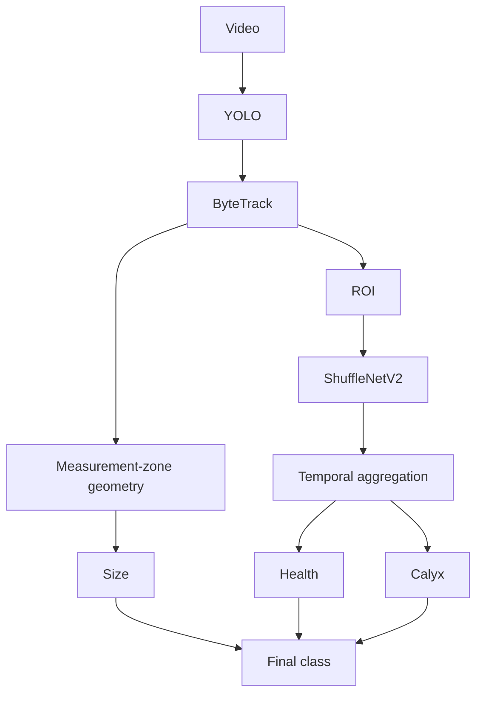
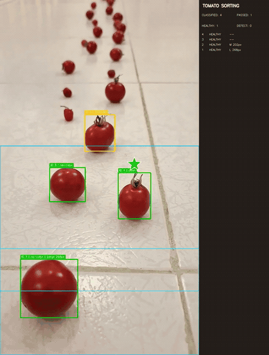

# Cherry Tomato Vision Sorting

**English** | [فارسی](README.fa.md)

An offline computer-vision pipeline for sorting cherry tomatoes from conveyor-belt video.

- **Input:** one video, a directory of videos, or a glob pattern.
- **Output:** an annotated video plus per-tomato JSON, size CSV, and runtime benchmark JSON.
- **Pipeline:** YOLO detection → ByteTrack tracking → ROI extraction → ShuffleNetV2 inference → temporal aggregation → composite sorting class.

The system produces **12 final sorting states**, but no neural network directly predicts 12 classes. The final label is composed from `3 sizes × 2 health states × 2 calyx states`. Size comes from bounding-box geometry; health and calyx come from the two classifier heads.

## Architecture



The detector runs on each frame. ByteTrack preserves identity across frames. Crops from matched tracks are evaluated by a two-head ShuffleNetV2 model, and repeated observations are aggregated before a health decision is locked. Calyx probabilities are averaged over observations. Size is measured independently in a fixed measurement zone.

## Demo



- [Annotated output](assets/demo/annotated_sample.mp4)

This demo is the annotated output of the revised pipeline with the `150/250 px` size thresholds. For a tighter portfolio preview, the first 15 source seconds play at `1.3×` speed and the final two source seconds are removed; the annotations themselves are unchanged. The GIF is a short excerpt of the same output.

Tomatoes with a detected calyx are marked with a star above the bounding box. The star color follows the health-decision color used by the visualization.

## Results

Classifier metrics are from the bundled held-out test metadata (`n = 208`):

| Task | Accuracy | Precision | Recall | F1 | ROC AUC |
|---|---:|---:|---:|---:|---:|
| Health | 92.31% | 83.33% | 83.33% | 83.33% | 95.48% |
| Calyx | 97.12% | 99.35% | 96.86% | 98.09% | 98.67% |

Joint health-and-calyx accuracy is **89.90%**. These numbers describe the classifier test set, not end-to-end conveyor performance. Detection, tracking, camera geometry, and temporal policy can change system-level results.

### Sample end-to-end run

The two-video Colab run completed successfully on CPU. These are execution counts, not accuracy measurements:

| Video | Tracks | Classified | Health: H/U | Calyx: P/A | Size: S/M/L | Processing FPS |
|---|---:|---:|---:|---:|---:|---:|
| `video_01.mp4` | 60 | 56 | 39 / 17 | 29 / 27 | 7 / 21 / 13 | 6.81 |
| `video_02.mp4` | 60 | 56 | 42 / 14 | 31 / 25 | 19 / 34 / 1 | 6.47 |

Four tracks in each video ended without a locked classification. Size totals can also be lower than classified-track totals because size is recorded only when a valid tracked box enters the measurement zone.

## Installation

Python 3.10 through 3.13 is supported. The requirements file selects a compatible PyTorch/torchvision pair for Python 3.13 automatically. Pinned wheel availability was checked for Linux x86-64, Windows x86-64, and macOS Apple Silicon; the complete pipeline was executed on Colab/Linux CPU.

### Linux and macOS

```bash
git clone https://github.com/aminashojaei/cherry-tomato-vision-sorting.git
cd cherry-tomato-vision-sorting
python -m venv .venv
source .venv/bin/activate
python -m pip install --upgrade pip
pip install -r requirements.txt
```

### Windows PowerShell

```powershell
git clone https://github.com/aminashojaei/cherry-tomato-vision-sorting.git
Set-Location cherry-tomato-vision-sorting
py -m venv .venv
.\.venv\Scripts\Activate.ps1
python -m pip install --upgrade pip
python -m pip install -r requirements.txt
```

For CUDA, install the matching PyTorch build for the target CUDA runtime first, then install the remaining pinned dependencies.

## Docker

The Docker workflow pins the Python 3.11.11 base image and Python packages and targets `linux/amd64`. During every final-image build it verifies the two model hashes and runs the complete unit-test suite. The runtime stage depends on a marker created by the test stage, so a failed test prevents the runtime image from being built.

```bash
mkdir -p inputs outputs
docker compose build
docker compose run --rm tomato-sorting
```

Place input videos in `inputs/`; generated reports and annotated videos appear in `outputs/`. Windows PowerShell commands, a one-video smoke test, and troubleshooting are documented in [Docker CPU workflow](docs/DOCKER.md).

## Usage

Process one video:

```bash
python run_pipeline.py \
  --config config/config.yaml \
  --input inputs/sample.mp4 \
  --output-dir outputs
```

Process a directory:

```bash
python run_pipeline.py \
  --config config/config.yaml \
  --input inputs \
  --output-dir outputs
```

Useful overrides:

```bash
python run_pipeline.py \
  --config config/config.yaml \
  --input inputs/sample.mp4 \
  --output-dir outputs/smoke-test \
  --device cpu \
  --max-frames 120
```

Each video receives its own folder containing `annotated.mp4`, `tomatoes.json`, `size_measurements.csv`, and `benchmark.json`. A batch-level `batch_summary.json` is also written.

The Colab notebook in `notebooks/` installs the same requirements, verifies checkpoint hashes, runs the same CLI, summarizes output JSON, previews annotated videos, and downloads the output archive.

## Models

| Component | File | Purpose |
|---|---|---|
| YOLO detector | `models/detector/yolo_tomato_detector.pt` | Tomato detection |
| ShuffleNetV2 multi-head | `models/classifier/shufflenet_multitask.pt` | Binary health and calyx logits |
| Threshold metadata | `models/classifier/shufflenet_multitask_thresholds.json` | Validation-selected decision thresholds |
| Test metadata | `models/classifier/shufflenet_multitask_metrics.json` | Held-out classifier metrics |

Release checkpoint SHA-256 values:

```text
d7de5dfd8a97509fb0e749c0030942323f1a3b9c390279d156b389af04d0e82d  yolo_tomato_detector.pt
d209caa10840b07aee07940d2de6747c7906c3cba7b8a12c825eae3bcdfb8c09  shufflenet_multitask.pt
```

Health uses `unhealthy` as the positive class with threshold `0.375`. Calyx uses `present` as the positive class with threshold `0.77`.

## Dataset

The training images are not included in this repository. The bundled metadata records a 208-image held-out classifier test split. Dataset provenance, collection protocol, class balance, and licensing should be published before the reported metrics are treated as independently reproducible.

Input videos are expected to resemble the deployment view: a fixed camera, stable conveyor path, and tomatoes moving through the configured tracking, classification, and measurement zones.

## Size Estimation

Size is currently a **pixel-space proxy**, not a physical diameter measurement. For the first valid observation inside the measurement zone, the system takes the shorter side of the tracked bounding box:

- `Small`: short side ≤ 150 px
- `Medium`: 150 px < short side ≤ 250 px
- `Large`: short side > 250 px

The measurement zone limits estimates to a narrow part of the frame where perspective is more consistent. Without a camera calibration and a known object-to-camera geometry, identical tomatoes can occupy different pixel sizes at different image locations. The thresholds therefore apply only to camera setups comparable to the one used to tune them.

To recalibrate, change `size_estimation.thresholds` and the relevant zones in `config/config.yaml`. The displayed zones use these same settings. The current estimator deliberately accepts only `metric: min_dimension` and `required_samples: 1`; increasing the sample count requires implementing a multi-observation policy.

## Limitations

- Size classes are based on pixels and cannot be interpreted as millimetres.
- The size thresholds and zones are camera-specific and must be recalibrated after changes in resolution, crop, lens, camera height, or conveyor geometry.
- The reported classifier metrics do not measure detector misses, tracking identity switches, or full-pipeline sorting accuracy.
- Temporal aggregation reduces frame-level noise but can delay a final decision.
- Calyx sampling stops when the health decision locks; its average can use fewer samples than a separate calyx policy would.
- `passed` means a classified track disappeared for the configured tracking buffer. It does not prove crossing a physical exit line; tracks still active at the end of the video are not counted as passed.
- The included checkpoints are PyTorch binaries; load only checkpoints obtained from a trusted source.
- The current pipeline is offline video processing, not a real-time actuator controller.
- The bundled Docker image is CPU-only and targets Linux x86-64. Apple Silicon runs it through Docker's x86-64 emulation.

## Project Structure

```text
cherry-tomato-vision-sorting/
├── classifier/       # ShuffleNetV2 model, preprocessing, temporal policy
├── config/           # Runtime configuration and decision thresholds
├── core/             # Schemas, interfaces, configuration validation
├── crop/             # ROI extraction and optional quality gates
├── detector/         # YOLO inference adapter
├── docs/             # Architecture source
├── geometry/         # Pixel-space size estimation
├── models/           # Release checkpoints and model metadata
├── notebooks/        # Colab workflow using the same CLI and config
├── pipeline/         # Single-video and batch orchestration
├── tests/            # Unit and compatibility tests
├── tracker/          # ByteTrack adapter and track state
├── utils/            # Video I/O, reports, device and timing helpers
├── visualization/    # Bounding boxes, zones, status sidebar
├── Dockerfile        # Tested multi-stage CPU image
├── compose.yaml      # Input/output volume workflow
├── requirements-docker-cpu.txt
├── requirements.txt
├── README.fa.md
└── run_pipeline.py
```

Run the lightweight test suite with:

```bash
python -m unittest discover -s tests -v
```

For a Persian walkthrough of updating this GitHub repository, see [راهنمای به‌روزرسانی در GitHub](docs/GITHUB_PUBLISHING.fa.md).
